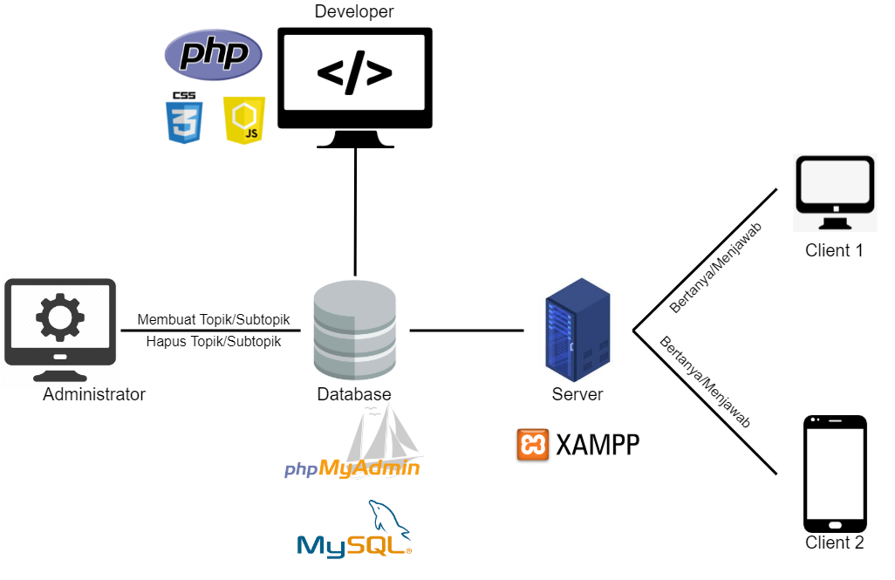

[Deskripsi](#deskripsi) | [Konsep OOP](#konsep-oop) | [Tipe Desain Pengembangan](#tipe-desain-pengembangan) | [Hasil dan Pembahasan](#hasil-dan-pembahasan) | [Hasil Implementasi](#hasil-implementasi) | [Saran](#saran) | [Developer dan Jobdesk](#developer-dan-jobdesk)
:---:|:---:|:---:|:---:|:---:|:---:|:---:

# Deskripsi Singkat Aplikasi

Forum Menfess IPB adalah media forum berbasis web untuk para mahasiswa IPB berpendapat secara anonim.

#### User Analysis
Website Forum Menfess IPB memiliki 1 jenis pengguna, yaitu mahasiswa. Mahasiswa pengguna website Forum Menfess IPB dibagi menjadi 2 lagi, mahasiswa yang membuat post dan juga mahasiswa yang me-reply-nya. Kedua hal tersebut dapat dilakukan secara anonim atau tanpa identitas. Sehingga mahasiswa dapat leluasa mengeluarkan pendapatnya tanpa khawatir identitasnya diketahui. 

##### User Stories
Saya, sebagai mahasiswa IPB ingin dapat mengutarakan keresahan saya, saya juga tidak ingin identitas saya diketahui ketika saya berpendapat, agar saya dapat berpendapat dengan lebih leluasa.  

#### Spesifikasi
##### Software
Visual Code Studio, PHP Native, CSS, JavaScript, mySQL, Xampp, Github

##### Hardware
Intel Core i5-8250U, NVIDIA GeForce mx 150, 8 GB DDR4, 1000 GB HDD

# Konsep OOP
[`^ kembali ke atas ^`](#)

Pengertian OOP (Object Oriented Programming) adalah suatu metode pemrograman yang berorientasi kepada objek. Tujuan dari OOP diciptakan adalah untuk mempermudah pengembangan program dengan cara mengikuti model yang telah ada di kehidupan sehari-hari. Jadi setiap bagian dari suatu permasalahan adalah objek, nah objek itu sendiri merupakan gabungan dari beberapa objek yang lebih kecil lagi.

#### Enkapsulasi

**Enkapsulasi** adalah salah satu yang paling terpenting di dalam pemrograman berorientasi objek(OOP). karena tahap enkapsulasi lah yang menentukan pemberian hak akses pada setiap property atau method.

#### Inheritance

**Inheritance** atau pewarisan sifat merupakan class turunan dari class yang lainnya. inheritance di buat dengan membuat class baru dengan tujuan di hubungkan dengan class yang lain yang di inginkan. dengan tujuan untuk mendapatkan informasi atau data dari class yang di hubungkan tersebut.

# Tipe Desain Pengembangan
[`^ kembali ke atas ^`](#)

Pada projek kali ini, kami menggunakan tipe desain pengembangan waterfall method. Waterfall method adalah tipe desain pengembangan yang bergerak linear, beurutan, dan sistematis. Tahap yang dilakukan pada waterfall adalah requirements, design, implementation, verification, dan terakhir maintenance. Salah satu kelebihan waterfall method adalah sangat sistematis dan linear, tahap selanjutnya tidak dapat dilakukan sebelum tahap sebelumnya selesai. Tetapi waterfall method juga memiliki kekurangan, antara lain adalah karena memiliki tahap yang linear, projek yang kompleks yang sering melakukan perubahan requirements tidak cocok menggunakan metode ini.

Alasan kami menggunakan waterfall method adalah karena memiliki tahapan yang linear dan sistematis, sehingga cocok untuk kami yang masih memiliki banyak kendala dan butuh banyak belajar dalam men-develop aplikasi, terutama yang berbasis web seperti ini. Alasan lainnya adalah aplikasi yang kami buat tidak membutuhkan perubahan requirements yang terus menerus dan juga waterfall method salah satu metode yang sangat cocok untuk membuat aplikasi sederhana. 

# Hasil dan Pembahasan
[`^ kembali ke atas ^`](#)
#### Use Case Diagram
<h1 align="left"></h1>

#### Activity Diagram
##### Pembuat Post

##### Pembalas Post

#### Entity Relationship Diagram

#### Class Diagram

#### Arsitektur Sistem
<h1 align="left"></h1>

#### Fungsi Utama yang Dikembangkan
Fungsi utama dari aplikasi yang kami kembangkan adalah pengguna dapat mem-posting sesuatu secara anonim pada topik tertentu yang sudah disediakan di website. Pengguna juga dapat me-reply post dari pengguna lain secara anonim juga. 

# Hasil Implementasi
[`^ kembali ke atas ^`](#)

# Saran
[`^ kembali ke atas ^`](#)

Sistem yang kami buat masih perlu dikembangkan lebih lanjut, karena kelompok kami tidak menggunakan framework dalam pengembangan (PHP Native) sehingga sistem yang kami buat terasa "basic". Disarankan menggunakan framework bila ingin membuat sistem yang serupa agar pengembangan lebih mudah.

# Developer & Jobdesk
[`^ kembali ke atas ^`](#)

| Nama                   |      NIM        |      Jobdesk     |
| ---------------------- | --------------- | ---------------- |
| Yuda Baskara           | G64180046       |  Project Manager, User Analyst |
| Ahmad Tedy Murtadho    | G64180082       |  Back End        |
| Muhammad Andhika Gema  | G64180055       |  UI/UX Designer, Front End  |
| Fawwaz Khairi          | G64180042       |  Front End       |
| Muhammad Khadafi       | G64180039       |  System Analyst  |

