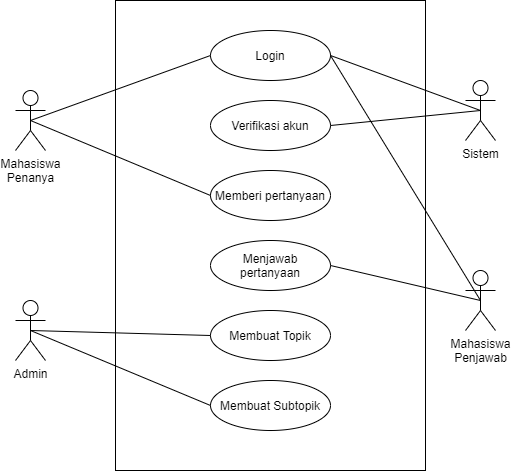

<h1 align="center"></h1>

[Deskripsi](#deskripsi) | [Konsep OOP](#konsep-oop) | [Tipe Desain Pengembangan](#tipe-desain-pengembangan) | [Hasil dan Pembahasan](#hasil-dan-pembahasan) | [Hasil Implementasi](#hasil-implementasi) | [Saran](#saran) | [Developer dan Jobdesk](#developer-dan-jobdesk)
:---:|:---:|:---:|:---:|:---:|:---:|:---:

# Deskripsi Singkat Aplikasi
[`^ kembali ke atas ^`](#)
Forum Menfess IPB adalah media forum berbasis web untuk para mahasiswa IPB berpendapat secara anonim.

#### User Analysis
Website Forum Menfess IPB memiliki 1 pengguna, yaitu mahasiswa. Mahasiswa pengguna website Forum Menfess IPB dibagi menjadi 2 lagi, mahasiswa yang membuat post dan juga mahasiswa yang me-reply-nya. Kedua hal tersebut dapat dilakukan secara anonim atau tanpa identitas. Sehingga mahasiswa dapat leluasa mengeluarkan pendapatnya tanpa khawatir identitasnya diketahui. 

##### User Stories
Saya, sebagai mahasiswa IPB ingin dapat mengutarakan keresahan saya, saya juga tidak ingin identitas saya diketahui ketika saya berpendapat, agar saya dapat berpendapat dengan lebih leluasa.  

#### Spesifikasi
##### Software
Visual Code Studio, PHP Native, CSS, mySQL, Github

##### Hardware
Intel Core i5-8250U, NVIDIA GeForce mx 150, 8 GB DDR dual channel, 1000 GB HDD

# Konsep OOP
[`^ kembali ke atas ^`](#)

# Tipe Desain Pengembangan
[`^ kembali ke atas ^`](#)

Lorem Ipsum

# Hasil dan Pembahasan
[`^ kembali ke atas ^`](#)
#### Use Case Diagram
<h1 align="left"></h1>

#### Activity Diagram
##### Pembuat Post

##### Pembalas Post

Lorem Ipsum

# Hasil Implementasi
[`^ kembali ke atas ^`](#)

Lorem Ipsum

# Saran
[`^ kembali ke atas ^`](#)

Lorem Ipsum

# Developer & Jobdesk
[`^ kembali ke atas ^`](#)

Lorem Ipsum

# Referensi
[`^ kembali ke atas ^`](#)

1. 
2. 
3. 
4. 
5. 
